# 32blit Games Collection for Funkey-S / RG-Nano.
   

A collection of [32blit](https://32blit.com/) games running through SDL2 on Funkey-S / RG-Nano.

Extract the download zip's which contain the opk files in the `Native games` folder on your Funkey / RG-Nano (sdcard)

Note: Some Games colors are not as intended / how they originally are, i have no idea whats causing this.

## match3
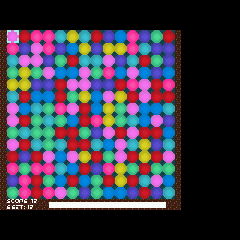

**Author**: [deckerego](https://github.com/deckerego)  
**Repository**: [deckerego/picosystem-demo](https://github.com/deckerego/picosystem-demo)  
**Download**: [match3 - 32blit - Funkey-s.zip](https://github.com/joyrider3774/32blit_funkey/releases/latest/download/match3.-.32blit.-.Funkey-s.zip)

---

## dots
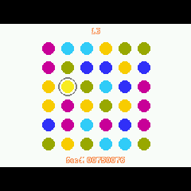

**Author**: [Gadgetoid](https://github.com/Gadgetoid)  
**Repository**: [Gadgetoid/32blit-dots](https://github.com/Gadgetoid/32blit-dots)  
**Download**: [dots - 32blit - Funkey-s.zip](https://github.com/joyrider3774/32blit_funkey/releases/latest/download/dots.-.32blit.-.Funkey-s.zip)

---

## amaze
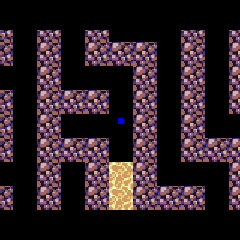

**Author**: [andreban](https://github.com/andreban)  
**Repository**: [andreban/32blit-a-maze](https://github.com/andreban/32blit-a-maze)  
**Download**: [amaze - 32blit - Funkey-s.zip](https://github.com/joyrider3774/32blit_funkey/releases/latest/download/amaze.-.32blit.-.Funkey-s.zip)

---

## armadillo
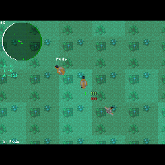

**Author**: [felipemanga](https://github.com/felipemanga)  
**Repository**: [felipemanga/Armadillo32Blit](https://github.com/felipemanga/Armadillo32Blit)  
**Download**: [armadillo - 32blit - Funkey-s.zip](https://github.com/joyrider3774/32blit_funkey/releases/latest/download/armadillo.-.32blit.-.Funkey-s.zip)

---

## TowerDefense
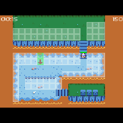

**Author**: [Blackhawk-TA](https://github.com/Blackhawk-TA)  
**Repository**: [Blackhawk-TA/TowerDefense](https://github.com/Blackhawk-TA/TowerDefense)  
**Download**: [TowerDefense - 32blit - Funkey-s.zip](https://github.com/joyrider3774/32blit_funkey/releases/latest/download/TowerDefense.-.32blit.-.Funkey-s.zip)

---

## Solitaire
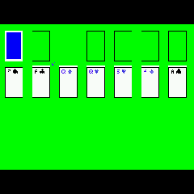

**Author**: [ThatOtherOtherBob](https://github.com/ThatOtherOtherBob)  
**Repository**: [ThatOtherOtherBob/Solitaire](https://github.com/ThatOtherOtherBob/Solitaire)  
**Download**: [Solitaire - 32blit - Funkey-s.zip](https://github.com/joyrider3774/32blit_funkey/releases/latest/download/Solitaire.-.32blit.-.Funkey-s.zip)

---

## minesweeper
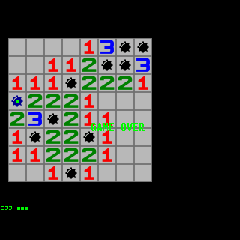

**Author**: [ArtemHarkusha](https://github.com/ArtemHarkusha)  
**Repository**: [ArtemHarkusha/minesweeper](https://github.com/ArtemHarkusha/32blit-minesweeper)  
**Download**: [minesweeper - 32blit - Funkey-s.zip](https://github.com/joyrider3774/32blit_funkey/releases/latest/download/minesweeper.-.32blit.-.Funkey-s.zip)

---

## 2048
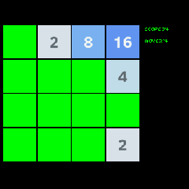

**Author**: [ArtemHarkusha](https://github.com/ArtemHarkusha)  
**Repository**: [ArtemHarkusha/2048](https://github.com/ArtemHarkusha/32blit-2048)  
**Download**: [2048 - 32blit - Funkey-s.zip](https://github.com/joyrider3774/32blit_funkey/releases/latest/download/2048.-.32blit.-.Funkey-s.zip)

---

## Ping

**Author**: [ThePythonator](https://github.com/ThePythonator)  
**Repository**: [ThePythonator/Ping](https://github.com/ThePythonator/Ping)  
**Download**: [Ping - 32blit - Funkey-s.zip](https://github.com/joyrider3774/32blit_funkey/releases/latest/download/Ping.-.32blit.-.Funkey-s.zip)

---

## Super-Square-Bros
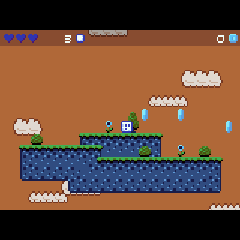

**Author**: [ThePythonator](https://github.com/ThePythonator)  
**Repository**: [ThePythonator/Super-Square-Bros](https://github.com/ThePythonator/Super-Square-Bros)  
**Download**: [Super-Square-Bros - 32blit - Funkey-s.zip](https://github.com/joyrider3774/32blit_funkey/releases/latest/download/Super-Square-Bros.-.32blit.-.Funkey-s.zip)

---

## Jumpy-Squirrel
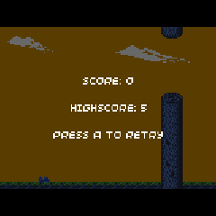

**Author**: [ThePythonator](https://github.com/ThePythonator)  
**Repository**: [ThePythonator/Jumpy-Squirrel](https://github.com/ThePythonator/Jumpy-Squirrel)  
**Download**: [Jumpy-Squirrel - 32blit - Funkey-s.zip](https://github.com/joyrider3774/32blit_funkey/releases/latest/download/Jumpy-Squirrel.-.32blit.-.Funkey-s.zip)

---

## 32blox
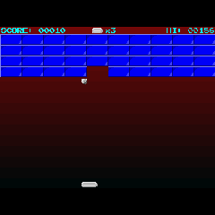

**Author**: [ahnlak-blit32](https://github.com/ahnlak-blit32)  
**Repository**: [ahnlak-blit32/32blox](https://github.com/ahnlak-blit32/32blox)  
**Download**: [32blox - 32blit - Funkey-s.zip](https://github.com/joyrider3774/32blit_funkey/releases/latest/download/32blox.-.32blit.-.Funkey-s.zip)

---

## sokoblit
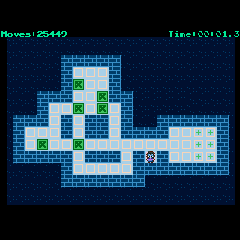

**Author**: [ahnlak-blit32](https://github.com/ahnlak-blit32)  
**Repository**: [ahnlak-blit32/sokoblit](https://github.com/ahnlak-blit32/sokoblit)  
**Download**: [sokoblit - 32blit - Funkey-s.zip](https://github.com/joyrider3774/32blit_funkey/releases/latest/download/sokoblit.-.32blit.-.Funkey-s.zip)

---

## 4inrow
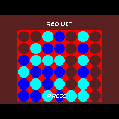

**Author**: [lummi01](https://github.com/lummi01)  
**Repository**: [lummi01/32Blit-4_in_a_row](https://github.com/lummi01/32Blit-4_in_a_row)  
**Download**: [4inrow - 32blit - Funkey-s.zip](https://github.com/joyrider3774/32blit_funkey/releases/latest/download/4inrow.-.32blit.-.Funkey-s.zip)

---

## alienattack
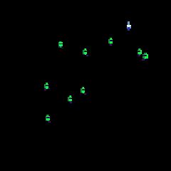

**Author**: [lummi01](https://github.com/lummi01)  
**Repository**: [lummi01/32Blit-AlienAttack](https://github.com/lummi01/32Blit-AlienAttack)  
**Download**: [alienattack - 32blit - Funkey-s.zip](https://github.com/joyrider3774/32blit_funkey/releases/latest/download/alienattack.-.32blit.-.Funkey-s.zip)

---

## asteroids
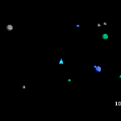

**Author**: [lummi01](https://github.com/lummi01)  
**Repository**: [lummi01/32Blit-Asteroids](https://github.com/lummi01/32Blit-Asteroids)  
**Download**: [asteroids - 32blit - Funkey-s.zip](https://github.com/joyrider3774/32blit_funkey/releases/latest/download/asteroids.-.32blit.-.Funkey-s.zip)

---

## cannonhead

**Author**: [lummi01](https://github.com/lummi01)  
**Repository**: [lummi01/32Blit-Cannonhead](https://github.com/lummi01/32Blit-Cannonhead)  
**Download**: [cannonhead - 32blit - Funkey-s.zip](https://github.com/joyrider3774/32blit_funkey/releases/latest/download/cannonhead.-.32blit.-.Funkey-s.zip)

---

## invader
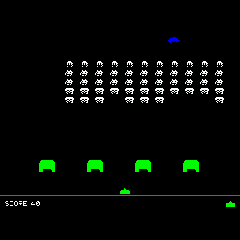

**Author**: [lummi01](https://github.com/lummi01)  
**Repository**: [lummi01/32Blit-Invader](https://github.com/lummi01/32Blit-Invader)  
**Download**: [invader - 32blit - Funkey-s.zip](https://github.com/joyrider3774/32blit_funkey/releases/latest/download/invader.-.32blit.-.Funkey-s.zip)

---

## harry
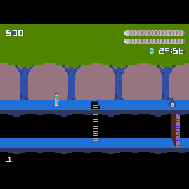

**Author**: [lummi01](https://github.com/lummi01)  
**Repository**: [lummi01/32Blit-Pitfall-Harry](https://github.com/lummi01/32Blit-Pitfall-Harry)  
**Download**: [harry - 32blit - Funkey-s.zip](https://github.com/joyrider3774/32blit_funkey/releases/latest/download/harry.-.32blit.-.Funkey-s.zip)

---

## snake2
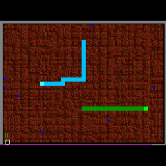

**Author**: [lummi01](https://github.com/lummi01)  
**Repository**: [lummi01/32Blit-SnakeRace](https://github.com/lummi01/32Blit-SnakeRace)  
**Download**: [snake2 - 32blit - Funkey-s.zip](https://github.com/joyrider3774/32blit_funkey/releases/latest/download/snake2.-.32blit.-.Funkey-s.zip)

---

## castle
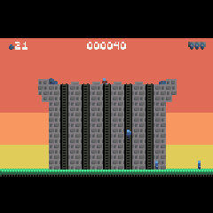

**Author**: [lummi01](https://github.com/lummi01)  
**Repository**: [lummi01/32Blit-Save-the-Castle](https://github.com/lummi01/32Blit-Save-the-Castle)  
**Download**: [castle - 32blit - Funkey-s.zip](https://github.com/joyrider3774/32blit_funkey/releases/latest/download/castle.-.32blit.-.Funkey-s.zip)

---

## indy
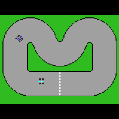

**Author**: [lummi01](https://github.com/lummi01)  
**Repository**: [lummi01/32Blit-Indy500](https://github.com/lummi01/32Blit-Indy500)  
**Download**: [indy - 32blit - Funkey-s.zip](https://github.com/joyrider3774/32blit_funkey/releases/latest/download/indy.-.32blit.-.Funkey-s.zip)

---

## missile
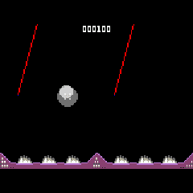

**Author**: [lummi01](https://github.com/lummi01)  
**Repository**: [lummi01/32Blit-MissileCommand](https://github.com/lummi01/32Blit-MissileCommand)  
**Download**: [missile - 32blit - Funkey-s.zip](https://github.com/joyrider3774/32blit_funkey/releases/latest/download/missile.-.32blit.-.Funkey-s.zip)

---

## dodgeem
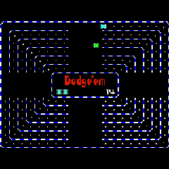

**Author**: [lummi01](https://github.com/lummi01)  
**Repository**: [lummi01/32Blit-Dodgeem](https://github.com/lummi01/32Blit-Dodgeem)  
**Download**: [dodgeem - 32blit - Funkey-s.zip](https://github.com/joyrider3774/32blit_funkey/releases/latest/download/dodgeem.-.32blit.-.Funkey-s.zip)

---

## tower

**Author**: [lummi01](https://github.com/lummi01)  
**Repository**: [lummi01/32Blit-Tower](https://github.com/lummi01/32Blit-Tower)  
**Download**: [tower - 32blit - Funkey-s.zip](https://github.com/joyrider3774/32blit_funkey/releases/latest/download/tower.-.32blit.-.Funkey-s.zip)

---

## gol
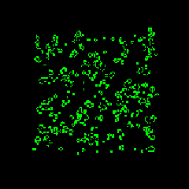

**Author**: [lummi01](https://github.com/lummi01)  
**Repository**: [lummi01/32Blit-game-of-life](https://github.com/lummi01/32Blit-game-of-life)  
**Download**: [gol - 32blit - Funkey-s.zip](https://github.com/joyrider3774/32blit_funkey/releases/latest/download/gol.-.32blit.-.Funkey-s.zip)

---

## dino

**Author**: [lummi01](https://github.com/lummi01)  
**Repository**: [lummi01/32Blit-Dino](https://github.com/lummi01/32Blit-Dino)  
**Download**: [dino - 32blit - Funkey-s.zip](https://github.com/joyrider3774/32blit_funkey/releases/latest/download/dino.-.32blit.-.Funkey-s.zip)

---

## bounce

**Author**: [lummi01](https://github.com/lummi01)  
**Repository**: [lummi01/32Blit-Bounce](https://github.com/lummi01/32Blit-Bounce)  
**Download**: [bounce - 32blit - Funkey-s.zip](https://github.com/joyrider3774/32blit_funkey/releases/latest/download/bounce.-.32blit.-.Funkey-s.zip)

---

## simon
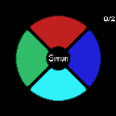

**Author**: [lummi01](https://github.com/lummi01)  
**Repository**: [lummi01/32Blit-SimonSays](https://github.com/lummi01/32Blit-SimonSays)  
**Download**: [simon - 32blit - Funkey-s.zip](https://github.com/joyrider3774/32blit_funkey/releases/latest/download/simon.-.32blit.-.Funkey-s.zip)

---

## Snake

**Author**: [lummi01](https://github.com/lummi01)  
**Repository**: [lummi01/32Blit-Snake](https://github.com/lummi01/32Blit-Snake)  
**Download**: [Snake - 32blit - Funkey-s.zip](https://github.com/joyrider3774/32blit_funkey/releases/latest/download/Snake.-.32blit.-.Funkey-s.zip)

---

## blit-racers

**Author**: [shane-powell](https://github.com/shane-powell)  
**Repository**: [shane-powell/blit-racers](https://github.com/shane-powell/blit-racers)  
**Download**: [blit-racers - 32blit - Funkey-s.zip](https://github.com/joyrider3774/32blit_funkey/releases/latest/download/blit-racers.-.32blit.-.Funkey-s.zip)

---

## fourblock-descent
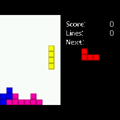

**Author**: [Daft-Freak](https://github.com/Daft-Freak)  
**Repository**: [Daft-Freak/fourblock-descent](https://github.com/Daft-Freak/fourblock-descent)  
**Download**: [fourblock-descent - 32blit - Funkey-s.zip](https://github.com/joyrider3774/32blit_funkey/releases/latest/download/fourblock-descent.-.32blit.-.Funkey-s.zip)

---

## blit-kart
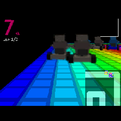

**Author**: [Daft-Freak](https://github.com/Daft-Freak)  
**Repository**: [Daft-Freak/super-blit-kart](https://github.com/Daft-Freak/super-blit-kart)  
**Download**: [blit-kart - 32blit - Funkey-s.zip](https://github.com/joyrider3774/32blit_funkey/releases/latest/download/blit-kart.-.32blit.-.Funkey-s.zip)

---

## rocks-and-diamonds
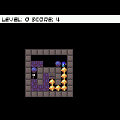

**Author**: [32blit](https://github.com/32blit)  
**Repository**: [32blit/rocks-and-diamonds](https://github.com/32blit/rocks-and-diamonds)  
**Download**: [rocks-and-diamonds - 32blit - Funkey-s.zip](https://github.com/joyrider3774/32blit_funkey/releases/latest/download/rocks-and-diamonds.-.32blit.-.Funkey-s.zip)

---

## carsprint

**Author**: [mikerr](https://github.com/mikerr)  
**Repository**: [mikerr/32blit-games](https://github.com/mikerr/32blit-games)  
**Download**: [carsprint - 32blit - Funkey-s.zip](https://github.com/joyrider3774/32blit_funkey/releases/latest/download/carsprint.-.32blit.-.Funkey-s.zip)

---

## dune2
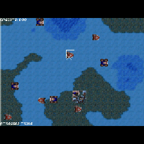

**Author**: [mikerr](https://github.com/mikerr)  
**Repository**: [mikerr/32blit-games](https://github.com/mikerr/32blit-games)  
**Download**: [dune2 - 32blit - Funkey-s.zip](https://github.com/joyrider3774/32blit_funkey/releases/latest/download/dune2.-.32blit.-.Funkey-s.zip)

---

## jetpac
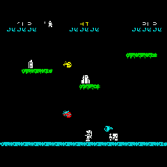

**Author**: [mikerr](https://github.com/mikerr)  
**Repository**: [mikerr/32blit-games](https://github.com/mikerr/32blit-games)  
**Download**: [jetpac - 32blit - Funkey-s.zip](https://github.com/joyrider3774/32blit_funkey/releases/latest/download/jetpac.-.32blit.-.Funkey-s.zip)

---

## knightlore
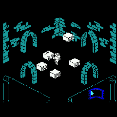

**Author**: [mikerr](https://github.com/mikerr)  
**Repository**: [mikerr/32blit-games](https://github.com/mikerr/32blit-games)  
**Download**: [knightlore - 32blit - Funkey-s.zip](https://github.com/joyrider3774/32blit_funkey/releases/latest/download/knightlore.-.32blit.-.Funkey-s.zip)

---

## willy
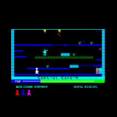

**Author**: [mikerr](https://github.com/mikerr)  
**Repository**: [mikerr/32blit-games](https://github.com/mikerr/32blit-games)  
**Download**: [willy - 32blit - Funkey-s.zip](https://github.com/joyrider3774/32blit_funkey/releases/latest/download/willy.-.32blit.-.Funkey-s.zip)

---

## wakkawakka
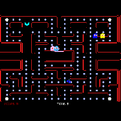

**Author**: [mikerr](https://github.com/mikerr)  
**Repository**: [mikerr/32blit-games](https://github.com/mikerr/32blit-games)  
**Download**: [wakkawakka - 32blit - Funkey-s.zip](https://github.com/joyrider3774/32blit_funkey/releases/latest/download/wakkawakka.-.32blit.-.Funkey-s.zip)

---

## geometry
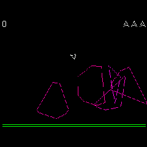

**Author**: [32blit](https://github.com/32blit)  
**Repository**: [32blit/32blit-examples](https://github.com/32blit/32blit-examples)  
**Download**: [geometry - 32blit - Funkey-s.zip](https://github.com/joyrider3774/32blit_funkey/releases/latest/download/geometry.-.32blit.-.Funkey-s.zip)

---

## raycaster
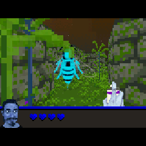

**Author**: [32blit](https://github.com/32blit)  
**Repository**: [32blit/32blit-examples](https://github.com/32blit/32blit-examples)  
**Download**: [raycaster - 32blit - Funkey-s.zip](https://github.com/joyrider3774/32blit_funkey/releases/latest/download/raycaster.-.32blit.-.Funkey-s.zip)

---

## scrolly-tile
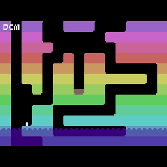

**Author**: [32blit](https://github.com/32blit)  
**Repository**: [32blit/32blit-examples](https://github.com/32blit/32blit-examples)  
**Download**: [scrolly-tile - 32blit - Funkey-s.zip](https://github.com/joyrider3774/32blit_funkey/releases/latest/download/scrolly-tile.-.32blit.-.Funkey-s.zip)
